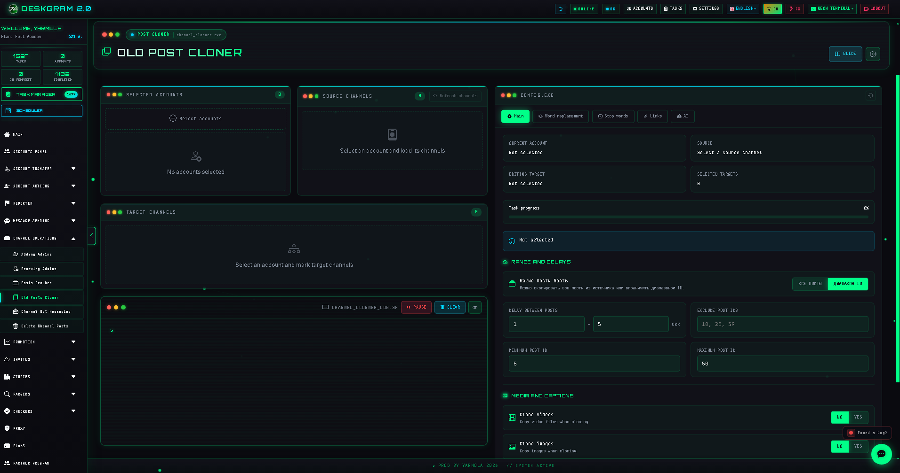
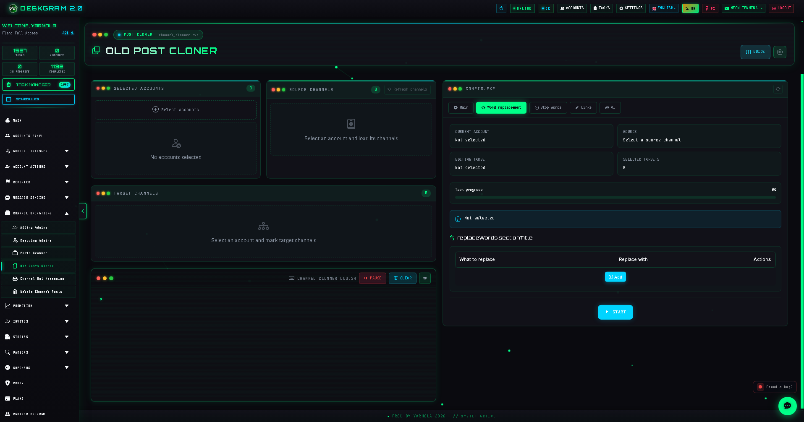
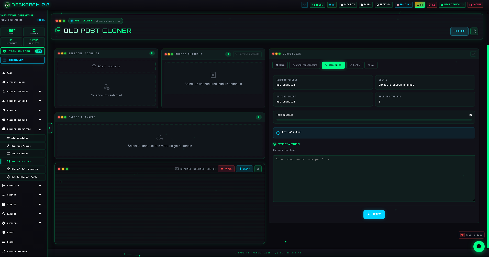
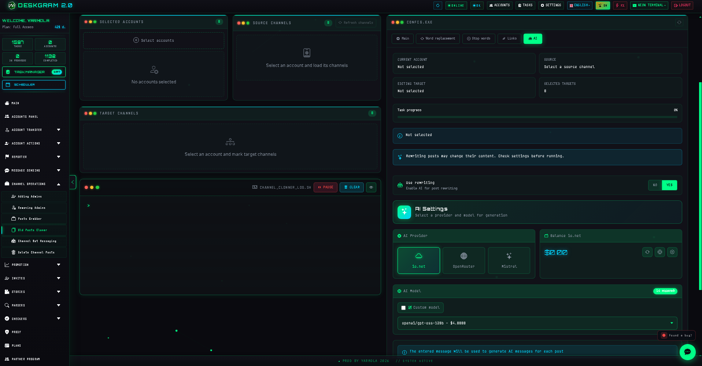

# Old Telegram Post Cloner with Deskgram 2

Old Posts Cloner in Deskgram 2 helps move and adapt already published content between Telegram channels without rebuilding every post manually. This module is useful when you want more than plain copying and need source-target pairs, text replacements, filters, link rules, and AI rewriting around old content.

[Deskgram 2 Hub](https://github.com/Deskgram-2/deskgram-2-telegram-automation-en) · [Website](https://deskgram2.com/) · [Telegram Bot](https://t.me/DG2welcomebot) · [Web Preview](https://deskgram2.com/web-preview?path=%2Fapp-demo%2F&lang=en)

## Interactive Web Preview

Try the module interface in the browser: [Open web preview](https://deskgram2.com/web-preview?path=%2Fapp-demo%2Ffunctions%2Fchannel_clonner&lang=en)

This makes it easier to inspect source-target mappings, replacement tabs, and AI options before a live content migration starts.

## Screenshots

## About the module

| Parameter | What is inside |
|---|---|
| Main task | Clone older Telegram posts between channels |
| Important blocks | Sources, targets, mappings, replacements, stop words, links, AI |
| Useful for | Content reuse, archive relaunches, channel network adaptation |
| Related sections | Post Grabber, Task Manager, Settings, Hub |

## What it can do

- select accounts, source channels, and target channels;
- build several source -> target mappings;
- apply replacement rules, stop words, and link settings;
- use AI rewriting to adapt copied posts;
- log execution and keep the mapping flow visible.

## Quick start

1. Select the working accounts and refresh the available channels.
2. Choose the source channel and one or more target channels.
3. Create mappings and configure them one by one.
4. Add replacements, stop words, link rules, and AI logic when needed.
5. Launch the task and inspect the progress in the log panel.

## Where this module fits best

- [Post Grabber](https://github.com/Deskgram-2/telegram-channel-post-grabber-deskgram-en), if you need a more flexible rebuild route with media and caption controls;
- [Task Manager](https://github.com/Deskgram-2/telegram-task-manager-deskgram-en), if content reuse should live inside a larger execution stack;
- [Automation Settings](https://github.com/Deskgram-2/telegram-automation-settings-deskgram-en), if the route depends on shared AI and system settings;
- [Channel Search](https://github.com/Deskgram-2/telegram-channel-search-deskgram-en), if the content layer is being paired with discovery and source research.

## When it is especially useful

- when there is an archive of old posts that should be reused across another channel set;
- when one source channel needs different adaptation rules for different targets;
- when content should be recycled, but not published as a raw copy;
- when archive content becomes part of a wider reuse and distribution workflow.

## What to choose: Old Posts Cloner or Post Grabber

| If your goal is | Better fit |
|---|---|
| Reuse older published posts through clear source-target mappings | [Old Posts Cloner](https://github.com/Deskgram-2/telegram-channel-post-cloner-deskgram-en) |
| Rebuild content with deeper media and caption controls | [Post Grabber](https://github.com/Deskgram-2/telegram-channel-post-grabber-deskgram-en) |
| Relaunch archive content through a lighter route | Old Posts Cloner |
| Build a more configurable content transformation layer | Post Grabber |

## Related repositories

- [Deskgram 2 Hub](https://github.com/Deskgram-2/deskgram-2-telegram-automation-en)
- [Post Grabber](https://github.com/Deskgram-2/telegram-channel-post-grabber-deskgram-en)
- [Task Manager](https://github.com/Deskgram-2/telegram-task-manager-deskgram-en)
- [Automation Settings](https://github.com/Deskgram-2/telegram-automation-settings-deskgram-en)
- [Channel Search](https://github.com/Deskgram-2/telegram-channel-search-deskgram-en)

## FAQ

### Can I inspect the interface before installing anything?

Yes. The web preview is already linked above, so you can open the module in a browser and inspect the mapping flow first.

### Does this module only copy posts as they are?

No. The practical value is in adapting old content through replacements, filters, link rules, and AI rewriting rather than just copying it blindly.
